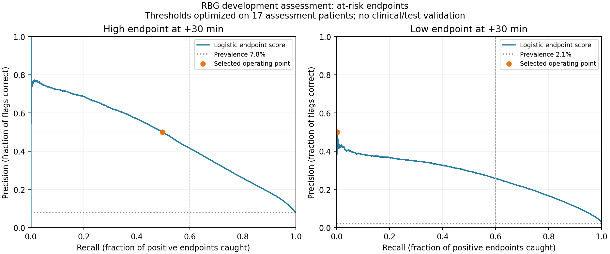

# RBG endpoint precision–recall diagnostics

Measured 9 October 2026 by reusing the saved logistic models. No refitting, calibration changes, test access or deployment changes. All figures remain development diagnostics on the same 17 assessment patients.

## Threshold tradeoffs

Precision is the fraction of flagged rows that are correct; recall is the fraction of positive endpoint rows caught. Lowering a threshold raises recall with a false-positive cost. These rows overlap in time and are not independent episodes or alarms.

| Endpoint | Requested minimum precision | Achieved precision | Recall | Correct flags | False flags |
|---|---:|---:|---:|---:|---:|
| high | 20% | 20.0% | 87.98% | 45,965 | 183,850 |
| high | 30% | 30.0% | 74.70% | 39,023 | 91,021 |
| high | 50% | 50.0% | 49.69% | 25,957 | 25,957 |
| high | 70% | 70.0% | 15.86% | 8,286 | 3,551 |
| high | 80% | 80.0% | 0.14% | 72 | 18 |
| low | 20% | 20.0% | 73.38% | 14,608 | 58,411 |
| low | 30% | 30.0% | 48.71% | 9,696 | 22,620 |
| low | 50% | 50.0% | 0.22% | 44 | 44 |
| low | 70% | 75.0% | 0.02% | 3 | 1 |
| low | 80% | 100.0% | 0.01% | 1 | 0 |

At recall at least 60%, the best observed precision is 41.5% for high and 25.8% for low. Therefore neither curve can meet the predeclared precision >=50% and recall >=60% simultaneously on this assessment set. Threshold changes alone cannot fix this requirement. Selecting any of these thresholds on the same assessment data remains optimistic.

## Patient-level failures at the saved operating thresholds

- High: all 17 assessment patients have positive endpoint rows; 0 have no true-positive flags. Median patient recall 50.77%, range 45.72%–55.56%. Patient-macro AP 0.473.
- Low: all 17 assessment patients have positive endpoint rows; 5 have no true-positive flags. Median patient recall 0.14%, range 0.00%–1.05%. Patient-macro AP 0.241.

No patient identifiers or per-patient records are published. The local detailed diagnostic CSV is ignored by Git. Patient uncertainty and source/population limitations remain; these curves do not establish medical acceptability.

## Decision

Keep flags and probability display disabled. High ranking is useful relative to prevalence but misses too many endpoints at the required precision. Low ranking is substantially weaker; a higher threshold nearly eliminates recall. A fixed nonlinear classifier is a reasonable next experiment to test whether glucose trends interact in ways the linear model misses. It must use the same frozen roles and show average precision, precision/recall, calibration and per-patient results. Do not keep searching configurations until the current development set passes.

Independent episode onset and repeated false-alarm burden still need a separate protocol. More complex models do not substitute for verified historical labs, meal/insulin context or independent validation.

[Aggregate diagnostics](rbg_endpoint_diagnostics.json); [original endpoint assessment](RBG_ENDPOINT_ASSESSMENT.md).
